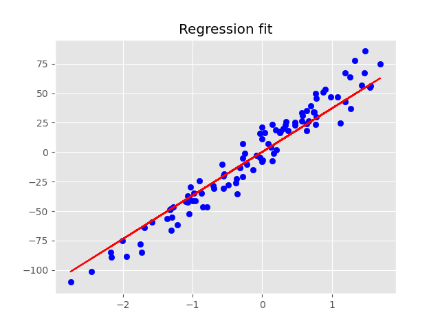

In this project, we implemented both linear regression and logistic regression from scratch using only numpy and python. We used gradient descent as our optimization algoritm all created in a simple jupyter notebook.

All it takes to make predictions is a little calculus and linear algebra.

 

